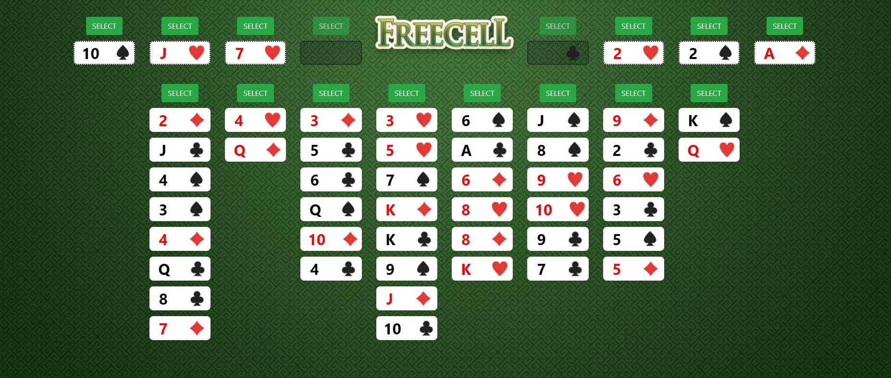

<h1 align="center">
  :clubs: :hearts: Freecell.JS :spades: :diamonds:
</h1>

<p align="center">
  <a href="#trophy-lessons-learned">Lessons Learned</a>&nbsp;&nbsp;&nbsp;|&nbsp;&nbsp;&nbsp;
  <a href="#rocket-technologies--resources">Technologies</a>&nbsp;&nbsp;&nbsp;|&nbsp;&nbsp;&nbsp;
  <a href="#hammer-setting-up-the-environment">Environment Setup</a>&nbsp;&nbsp;&nbsp;|&nbsp;&nbsp;&nbsp;
  <a href="#zap-features-implementations">Features</a>
</p>

<p align="center">
  

  

  

  

  
</p>



A simple Freecell Solitaire card game developed using the good-old AngularJS in order to demonstrate a custom **stack** data structure using JavaScript, besides having some fun. The process was initially proposed as a college assignment, but still maintained by me and open to Pull Requests.

[Check out the application running!](https://juliolmuller.github.io/freecell/)

## :trophy: Lessons Learned

- Creating a simple AngularJS application;
- Implementing C-like stack structure in JavaScript syntax;
- Creating JavaScript classes;
- Configure Webpack 5;

## :rocket: Technologies & Resources

**Frontend:**
- AngularJS (Angular 1)
- Babel, ESlint and Webpack
- Sound effects ([card flip](https://freesound.org/people/f4ngy/sounds/240776/), [card shuffle](https://freesound.org/people/deathpie/sounds/19245/), [victory](https://soundbible.com/1700-5-Sec-Crowd-Cheer.html), [failure](https://freesound.org/people/Benboncan/sounds/73581/))

**Development:**
- Visual Studio Code
- Node.js routines

## :hammer: Setting up the Environment

Make sure to have **Node.js 10+** installed in your machine and its **npm** available in the command line, then use the following routines:

```bash
$ npm install     # Download dependencies
$ npm start       # Run development server
$ npm run build   # Build files for production
```

## :zap: Features Implementations

- [x] Single-player game;
- [x] Good-looking interface;
- [x] Easter-Egg included;
- [x] Keyboard navigation;
- [x] Sound effects;
